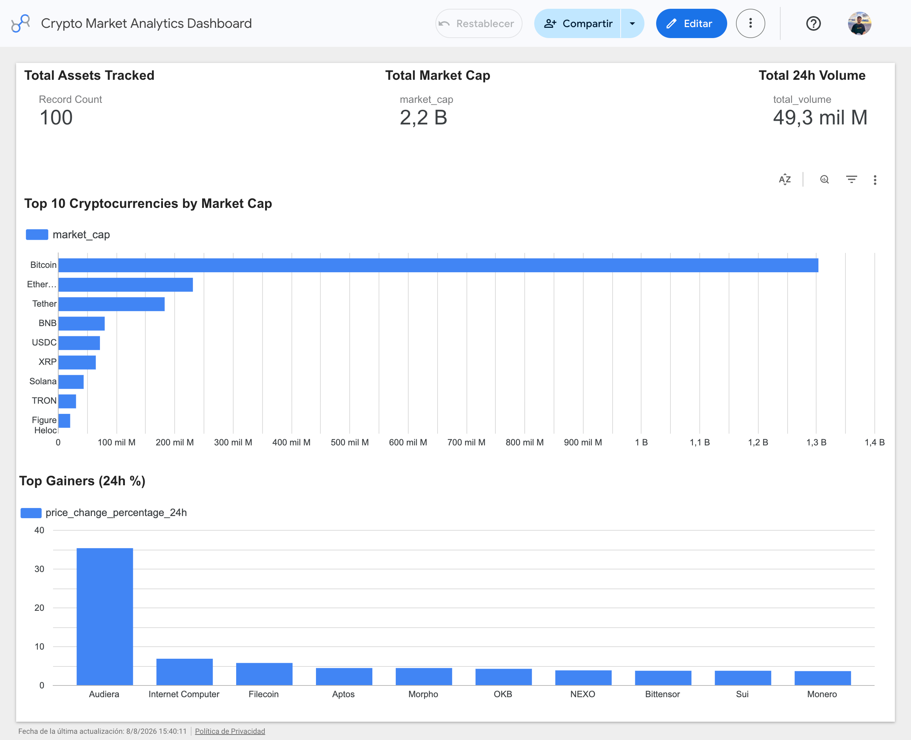

# Financial Market Analytics Dashboard

## Description
## Live Dashboard

Interactive dashboard built with Looker Studio, connected directly to BigQuery:

**[View Dashboard](https://lookerstudio.google.com/reporting/8627f325-3dc9-407b-83b4-dfba30d1ec55)**



The dashboard queries BigQuery in real time — every ETL run is immediately reflected in the visualizations.
This project implements a modular ETL (Extract, Transform, Load) pipeline that retrieves cryptocurrency market data from the CoinGecko API, transforms it into a clean dataset using Pandas, and loads it into Google BigQuery.

The cloud data warehouse serves as the foundation for interactive dashboards in Looker Studio.
The project serves as the data foundation for future analytics in BigQuery and interactive dashboards in Looker Studio.

---

## Objectives

- Extract cryptocurrency market data from the CoinGecko API.
- Transform and clean the data using Pandas.
- Load processed data into Google BigQuery.- Build a scalable ETL pipeline following data engineering best practices.
- Prepare the data for future visualization in Looker Studio.

---

## ETL Workflow

CoinGecko API
      │
      ▼
Extract (Python)
      │
      ▼
Transform (Pandas)
      │
      ▼
BigQuery
      │
      ▼
Looker Studio
---

## Technologies Used

* Python
* Pandas
* Requests
* Google BigQuery
* pandas-gbq
* SQL
* Git
* GitHub
* pip freeze > requirements.txt
* Looker Studio
---

## Project Structure

```text
financial-dashboard/
│
├── assets/
│   └── dashboard.png
│
├── notebooks/
│   └── api_exploration.ipynb
│
├── src/
│   ├── config.py
│   ├── extract.py
│   ├── transform.py
│   ├── load.py
│   └── main.py
│
├── .env.example
├── .gitignore
├── README.md
└── requirements.txt
```

---

## Installation

Clone the repository:

```bash
git clone https://github.com/yourusername/financial-dashboard.git
```

Navigate to the project directory:

```bash
cd financial-dashboard
```

Create and activate the virtual environment:

```bash
conda create -n financial python=3.12
conda activate financial
```

Install the dependencies:
Create a `.env` file based on the provided example:

```bash
cp .env.example .env
```

Then place your Google Cloud service account key in `credentials/service-account.json`.
```bash
pip install -r requirements.txt
```

---

## Usage

Run the ETL pipeline:

```bash
python src/main.py
```

The pipeline will:

- Extract cryptocurrency market data from the CoinGecko API.
- Transform the dataset.
- Load the processed data into a SQLite database.

---

## Data Warehouse

The ETL loads the processed data into Google BigQuery:

* **Dataset:** `crypto_data`
* **Table:** `crypto_market`

Authentication is handled through a Google Cloud service account using the `GOOGLE_APPLICATION_CREDENTIALS` environment variable.

- `crypto_market`

---

## Current Features

- Modular ETL architecture.
- Configuration management using `config.py`.
- Error handling with `try/except`.
- Logging with Python `logging`.
- Google BigQuery integration.
- Service account authentication via environment variables.
- SQL-ready dataset for analytics.

---

## Future Improvements

- Automate the ETL pipeline.
- Store historical cryptocurrency prices.
- Add unit tests.
- Deploy the pipeline to the cloud.

---

## Author

**Alexander Cadena**

Industrial Engineering Student

Interested in Data Analytics, Business Intelligence and Data Engineering.